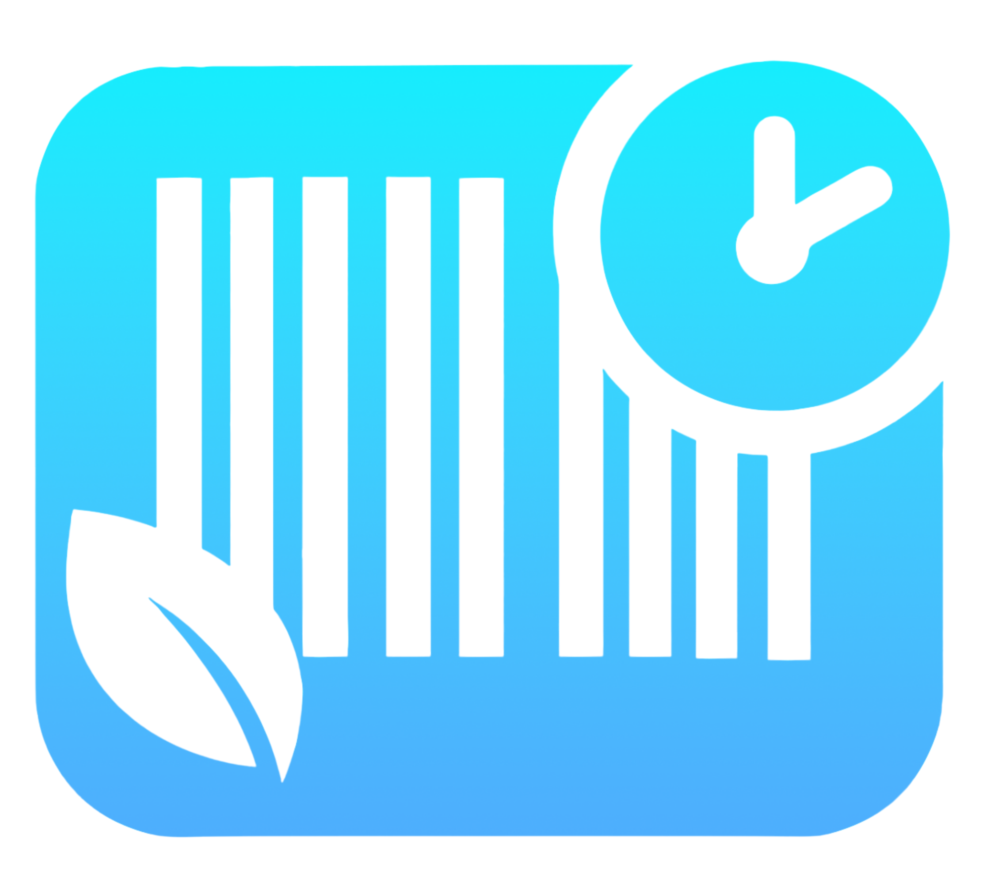

  

<h1 align="center">ExpiryX</h1>

  <em>Smart expiry tracking to reduce food waste and save money</em>

---

## 📖 About

ExpiryX is a modern Android app designed to help households **reduce food waste** by keeping track of grocery expiry dates.  
With ExpiryX, you can:

- 📷 **Scan barcodes or expiry labels** using your phone’s camera (powered by ML Kit).  
- 🛒 **Log food items** with details like quantity, weight, notes, and favourites.  
- ⏰ **Get notifications** before items expire so you can use them in time.  
- 📂 **View history** of expired, used, or deleted products, all archived automatically.  
- ⭐ **Mark favourites** to quickly find the products you care about most.  
- 📊 **Export your data** to a CSV file for backup or analysis.  

The app’s simple interface makes managing groceries easier, helping you save money and reduce environmental impact.

---

## 📲 Installation

1. **Download the APK**
   - Grab the latest release from the [Releases page](../../releases).

2. **Allow Installation**
   - On your Android device, enable installation from “Unknown Sources” if prompted.

3. **Install & Launch**
   - Open the APK file and install.  
   - Launch *ExpiryX* and start tracking your groceries!

---

## 🛠 Requirements

- **Android 7.0 (API 24)** or higher  
- Camera permission (for barcode scanning)  
- Notification permission (Android 13+)  

---
